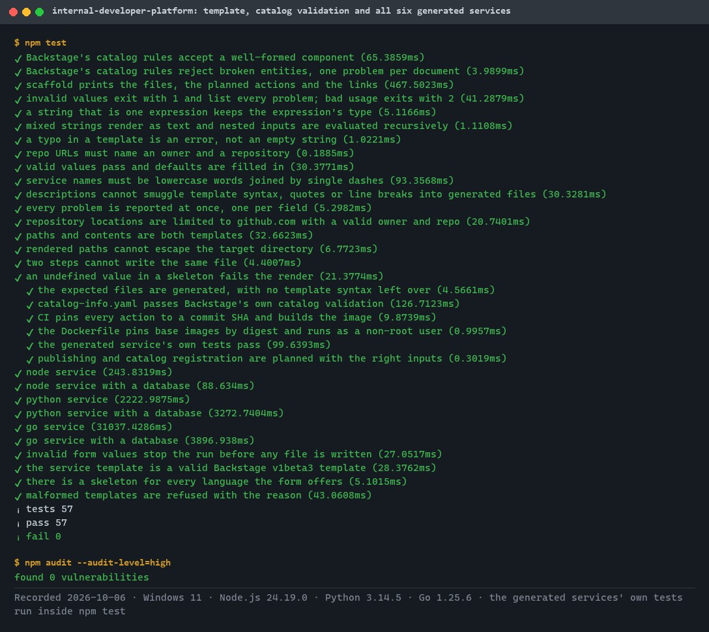
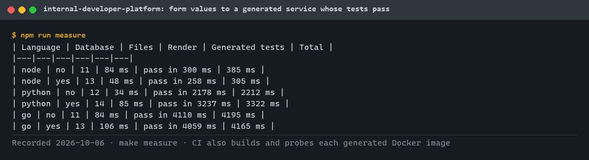
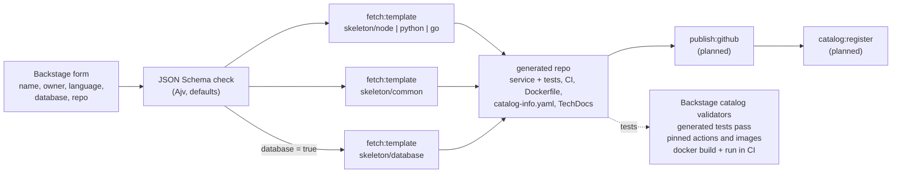
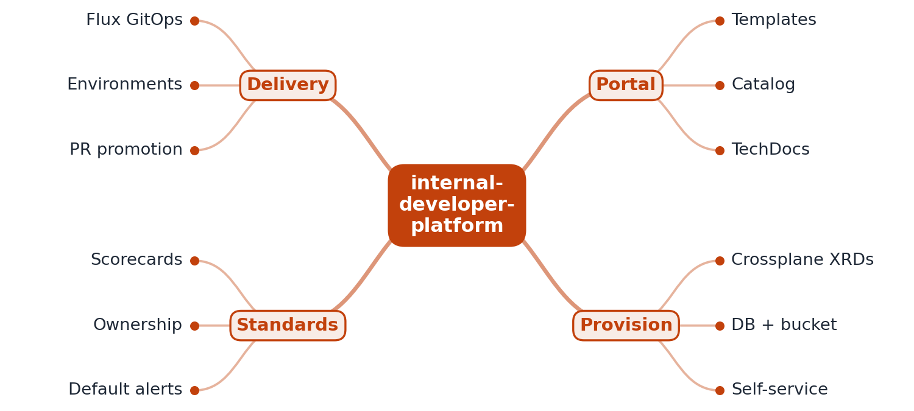
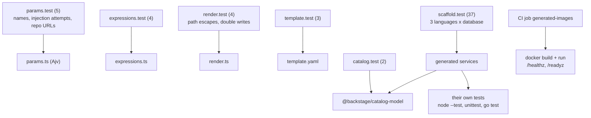

# internal-developer-platform

[](https://github.com/EquinoxWN/internal-developer-platform/actions/workflows/ci.yml)


> One Backstage form creates a ready-to-build service in Go, Node.js or Python: code skeleton, CI, Dockerfile, catalog entry and docs, with the template rendered and tested locally.

Part of my **DevOps and Cloud** list · TypeScript · YAML · core project

## Proof it works

`npm test` renders the Backstage template for all three languages with and without a database, validates every `catalog-info.yaml` with Backstage's own catalog rules, checks pinned actions and images, and runs each generated service's own tests (57 tests, 0 failed). The dependency audit is clean:



`npm run measure` times the path from form values to a generated service whose own tests pass:



## Architecture

**What M1 runs today:**



**Full roadmap (M1 to M3):**



## How it works

_Steps 1 and 2 are built and tested (M1); the rest is on the [roadmap](#roadmap)._

1. A developer fills in a Backstage template: name, language, whether it needs a database.
2. The template creates a repository from a skeleton with CI, a Dockerfile and catalog metadata already in place.
3. It also commits a Crossplane claim; Crossplane provisions the database and bucket through a composition the platform team controls.
4. Flux deploys the service to dev automatically, and promotion to prod is a pull request.
5. A default Grafana dashboard and alerts are generated for every new service.
6. Catalog scorecards show which services meet the standards: owner, docs, SLOs.

## Tech stack

| Area | In M1 | Planned |
|---|---|---|
| Portal | Backstage software template, catalog entries, TechDocs (mkdocs) | Catalog scorecards |
| Infra / deliver | - | Crossplane compositions, Flux CD GitOps |
| Observe | - | Grafana dashboards and alerts as code |
| Test | Local renderer (Nunjucks), Backstage catalog validation, each generated service's own tests | - |

Language: **TypeScript · YAML**. The template is in [`templates/service/`](templates/service) (Backstage YAML plus skeletons); the local scaffolder and CLI are in [`src/`](src).

## Run it

**Prerequisites:** Node.js 24+. To run the generated services' tests too: Python 3.12+ and Go 1.25+ (tests for a missing toolchain are skipped locally; CI has all three).

```bash
make setup     # npm ci
make lint      # strict TypeScript
make test      # 57 tests, including all six generated services
make measure   # time from form values to a generated service whose tests pass
```

Generate a service yourself (the same values the Backstage form collects):

```bash
npm run build
node dist/src/cli.js scaffold --template templates/service --out ./payments-api \
  --set name=payments-api --set "description=Takes card payments for the checkout flow." \
  --set owner=group:payments --set language=go --set database=true \
  --set "repoUrl=github.com?owner=acme&repo=payments-api"
node dist/src/cli.js validate-catalog ./payments-api/catalog-info.yaml
```

To use the template in a Backstage instance, register `templates/service/template.yaml` as a catalog location.

### What a generated service contains

| File | Standard it enforces |
|---|---|
| `src/...` and tests | Standard-library HTTP service with `/`, `/healthz` and (with a database) `/readyz`; tests pass on day one |
| `Dockerfile` | Base images pinned by digest; runs as `node`, `app` or distroless `nonroot` |
| `.github/workflows/ci.yml` | Read-only token, actions pinned to commit SHAs, tests then `docker build` |
| `catalog-info.yaml` | `Component` with owner, project slug and TechDocs; plus a `Resource` and `dependsOn` when a database is requested |
| `mkdocs.yml`, `docs/` | TechDocs pages |
| `db/migrations/` | First migration (database option only) |

## Tests and results

Full numbers and commands: [docs/results/m1.md](docs/results/m1.md).

| Check | Result |
|---|---|
| Tests (`make test`) | **57 passed**, 0 failed |
| Generated services | all 6 combinations pass Backstage catalog validation and their own tests |
| Injection and path safety | quotes, line breaks, `${{ }}`, `` and `../` refused before any file is written |
| Form to passing tests | 0.3 s (Node.js), 2.2 to 3.2 s (Python), 4.2 s (Go) |
| CI only | every generated image built, run, and probed on `/healthz` and `/readyz` |
| Lint / audit | strict `tsc` clean; `npm audit`: 0 vulnerabilities |

### Test map



## Roadmap

**M1** (≈15 h)
- [x] Write `docs/rfc/0001-design.md`: problem, goals, non-goals, chosen design
- [x] A developer fills in a Backstage template: name, language, whether it needs a database.
- [x] The template creates a repository from a skeleton with CI, a Dockerfile and catalog metadata already in place.

**M2** (≈20 h)
- [ ] It also commits a Crossplane claim; Crossplane provisions the database and bucket through a composition the platform team controls.
- [ ] Flux deploys the service to dev automatically, and promotion to prod is a pull request.

**M3** (≈25 h)
- [ ] A default Grafana dashboard and alerts are generated for every new service.
- [ ] Catalog scorecards show which services meet the standards: owner, docs, SLOs.
- [ ] Publish the proof below with real numbers

## Proof

What this repo must show before it counts as done:

- A 3-minute video from form to running service, and time-to-first-deploy before vs after.

| Result | Value |
|---|---|
| M3 proof above | Not measured yet (M3). Current M1 numbers: see [Tests and results](#tests-and-results). |

## Why it matters

- **Interview angle:** 'Improve developer productivity for 500 engineers'.
- **Upstream I'd like to contribute to:** Backstage (Spotify) or PipeCD (CyberAgent).

## Design docs

- [RFC 0001: design](docs/rfc/0001-design.md)
- [ADR 0001: record architecture decisions](docs/adr/0001-record-architecture-decisions.md)
- [ADR 0002: test the template by rendering it locally](docs/adr/0002-test-the-template-by-rendering-it-locally.md)
- [ADR 0003: restrict inputs instead of escaping](docs/adr/0003-restrict-inputs-instead-of-escaping.md)
- [M1 results](docs/results/m1.md)

## Scope

This is a learning and portfolio system, not a hosted production service. Everything runs locally.

## Security and contributing

- Every GitHub Action is pinned to a commit SHA; workflows run read-only, without persisted credentials.
- Dependabot proposes dependency and action updates weekly.
- Generated services start with digest-pinned images, non-root users and SHA-pinned actions; the template's input patterns block injection into generated files; CI runs `npm audit` on every push.
- Report vulnerabilities privately: see [SECURITY.md](SECURITY.md). To contribute, see [CONTRIBUTING.md](CONTRIBUTING.md).

## License

MIT, see [LICENSE](LICENSE).
